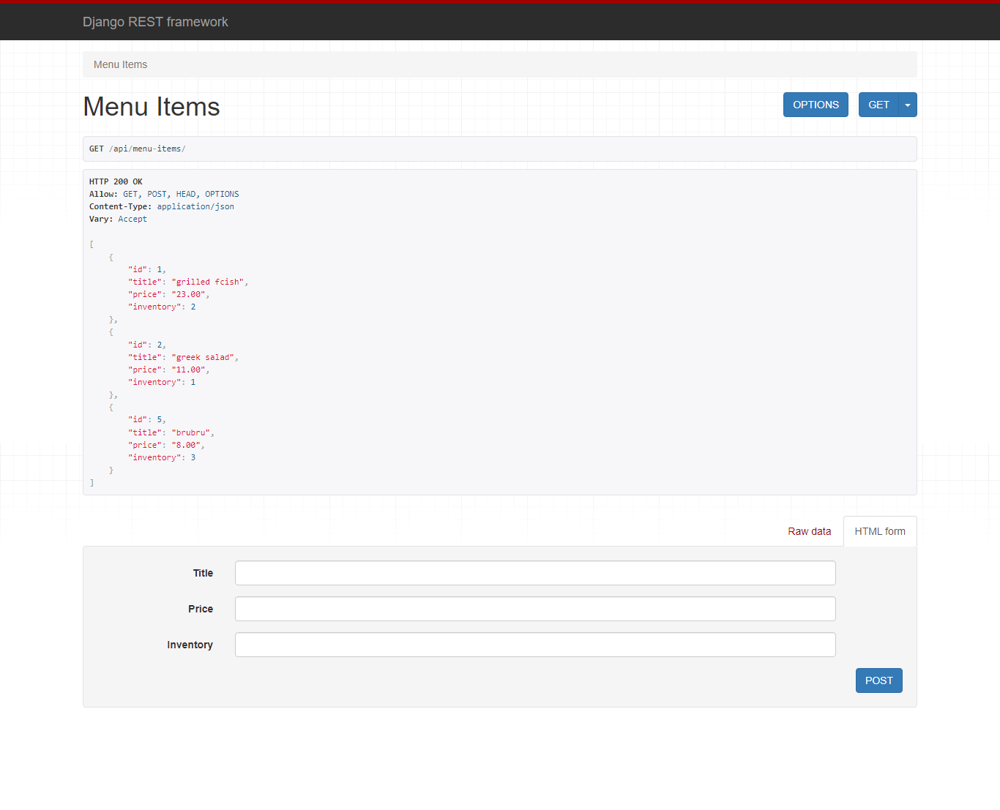

# Screenshots:



# Restaurant Menu Update API

## Overview
This project is a Django-based API designed to update the menu of a restaurant website. It allows users to manage inventory and pricing information for menu items through a RESTful interface built with Django Rest Framework (DRF). The API validates form data and utilizes serialization, validation, and deserialization techniques to provide data in both JSON and XML formats. Data is stored in a MySQL database, providing persistent storage for menu updates.

## Features
1. **Menu Update**: Provides endpoints for updating the menu of the restaurant site.
2. **Inventory and Price Management**: Users can update inventory and pricing information for menu items.
3. **Form Data Validation**: Utilizes DRF for validating form data before processing.
4. **Serialization and Deserialization**: Implements serialization, validation, and deserialization techniques for API data.
5. **Support for Multiple Formats**: Data is available in both JSON and XML formats.
6. **MySQL Database**: Stores data persistently, allowing for easy access and retrieval.

## Tech Stack
- Django
- Django Rest Framework (DRF)
- MySQL

## Installation
1. Clone the repository:
   ```bash
   git clone https://github.com/yourusername/restaurant-menu-api.git

    ```
   
2. Install Pipenv (if you haven't already):

    ```
    pip install pipenv
    ```

3. Install dependencies using Pipenv:

    ```
    pipenv install
    ```

4. Activate the Pipenv shell:

    ```
    pipenv shell
    ```


5. Run the development server:

    ```
    python manage.py runserver
    ```

6. Access the API in your browser at http://127.0.0.1:8000/api/menu-items
7. For xml output: http://127.0.0.1:8000/api/menu-items?format=xml
8. for JSON output: http://127.0.0.1:8000/api/menu-items?format=json

## Contributing

Contributions to the API are welcome! If you would like to contribute to the project, please fork the repository, make your changes, and submit a pull request.

## Contact

For questions or feedback regarding RestaurantSite, please contact at [shailendrapal840@gmail.com](mailto:shailendrapal840@gmail.com).


